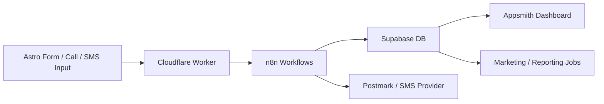

# ProjectX — Architecture

**Purpose:** Describe how ProjectX systems are structured and interact, so humans and AI tools can reason about code generation, automation flow, and deployment accurately.
**Scope:** Service layout, data flow, integrations, and trust boundaries.
**Audience:** Dev | Ops | AI tools
**See also:** [../02_Architecture/DEVOPS.md](../02_Architecture/DEVOPS.md), [../03_Development/DEVELOPER.md](../03_Development/DEVELOPER.md)

---

## System Overview

ProjectX is a modular automation platform that connects the contractor’s communication channels (forms, calls, SMS) to a unified backend system for lead capture, tracking, and marketing automation.

The flow begins with an **Astro + Tailwind landing page** where leads are captured. The data is securely sent via HTTPS POST to a **Cloudflare Worker**, which serves as an authentication and routing proxy.
The Worker validates and signs the request before forwarding it to an **n8n webhook** hosted on a VPS.
Within n8n, workflows execute business logic depending on the service module (Lead System, Call Tracking, Marketing). These workflows persist data to **Supabase** (Postgres) and trigger notifications through **Postmark** or an SMS provider.

Optionally, Supabase data feeds into an **Appsmith dashboard** for contractor visibility and operational reporting.

---

## Architecture Context — Three Core Service Modules

| Module                     | Description                                                                 | Example Workflow                                        |
| -------------------------- | --------------------------------------------------------------------------- | ------------------------------------------------------- |
| **Lead System**            | Captures web leads, stores them, and follows up automatically via SMS/email | Form → Worker → n8n → Supabase → Postmark               |
| **Call & SMS Tracking**    | Logs all inbound/outbound messages and calls for attribution and follow-up  | Twilio webhook → n8n → Supabase → Dashboard             |
| **Marketing & Reputation** | Automates review requests and optional campaign retargeting                 | Supabase trigger → n8n → Google Business API / Postmark |

Each module shares the same data backbone (Supabase) and automation layer (n8n) to ensure consistency and scalability.

---

## System Flow (High-Level)

1. **Frontend (Astro):** User submits a form or interacts with a call/SMS endpoint.
2. **Edge (Cloudflare Worker):** Validates, authenticates, and forwards data to n8n.
3. **Automation Layer (n8n):** Executes workflows depending on service type:

   * Lead intake and routing
   * Call/SMS logging and tagging
   * Review requests and remarketing triggers
4. **Database (Supabase):** Stores structured data (tables: `leads`, `calls`, `reviews`, `campaigns`).
5. **Notification Layer:** Sends transactional messages via Postmark or Twilio.
6. **Dashboard (Appsmith):** Displays leads, communications, and campaign data.

---

## Mermaid Diagram

---

## Data Flow (End-to-End)

1. User submits data via web form or communication channel.
2. Cloudflare Worker validates → attaches headers → signs → forwards to n8n.
3. n8n executes logic by module:

   * Lead routing or CRM sync
   * Call/SMS logging
   * Review or remarketing trigger
4. Supabase stores normalized records in respective tables.
5. Postmark/Twilio handle outbound communication.
6. Optional dashboards pull analytics or export CSVs.

---

## Integrations (Systems & Auth Modes)

| System                 | Purpose             | Auth Mode           | Notes                                          |
| ---------------------- | ------------------- | ------------------- | ---------------------------------------------- |
| **n8n**                | Workflow engine     | API key (env)       | Core automation and routing logic              |
| **Supabase**           | Database + Auth     | Service key (env)   | Data persistence and secure API access         |
| **Cloudflare Workers** | Proxy + API Gateway | Account token (env) | Validates incoming requests and signs traffic  |
| **Postmark**           | Email service       | Server token (env)  | Sends confirmations and internal notifications |
| **Twilio / Telnyx**    | Call & SMS service  | API key (env)       | Handles message delivery and logs              |
| **Appsmith**           | Internal dashboard  | Auth via Supabase   | Data visualization and client dashboards       |

---

## Security & Trust Boundaries

* **Worker = single public entry point** for all inbound requests.
* **n8n** is private and only accepts signed requests from the Worker.
* **Supabase** is not directly exposed to clients; all writes flow through n8n.
* **Secrets** are managed via `.env` (Docker + VPS environment variables).
* **RLS** (Row-Level Security) will be used for client dashboards.

---

## Scaling & Reliability Notes

* Add **Redis cache** for lead deduplication and rate limiting.
* Use **Prometheus + Grafana** for workflow and Worker monitoring.
* Deploy **Cloudflare rate limiting** for spam protection.
* Consider **Docker Swarm or Nomad** for scaling n8n nodes.
* Enable **Supabase backups + RLS policies** for tenant isolation.

---

## Future Additions

* `security-policy.md` — defines secret rotation, access control, and audit.
* `infra-map.md` — documents DNS, subdomains, and Worker routes.
* `data-schemas.md` — outlines tables and relationships for AI-assisted development.
* `monitoring.md` — defines log aggregation and alert pipelines.

---

## Summary for AI Tools

* **Architecture:** Astro → Cloudflare Worker → n8n → Supabase → Postmark/Twilio.
* **Data Direction:** Inbound data flows only through Worker; all writes originate from n8n.
* **Shared Stack:** All service modules reuse the same database and notification layers.
* **Auth & Secrets:** Declared in `DEVOPS.md`, injected at runtime.
* **Integration Contracts:** The table above defines canonical systems and trust relationships.

---

## Key Entities & Pointers

* **Entities:** ProjectX, n8n, Supabase, Cloudflare Workers, Postmark, Twilio, Appsmith
* **Paths:** `./workers/`, `./n8n/`, `./supabase/`, `./02_Architecture/DEVOPS.md`
* **Contract:**

  * `POST /lead` handled by Worker → validated → forwarded to n8n webhook
  * Environment variables declared and documented in `DEVOPS.md`

